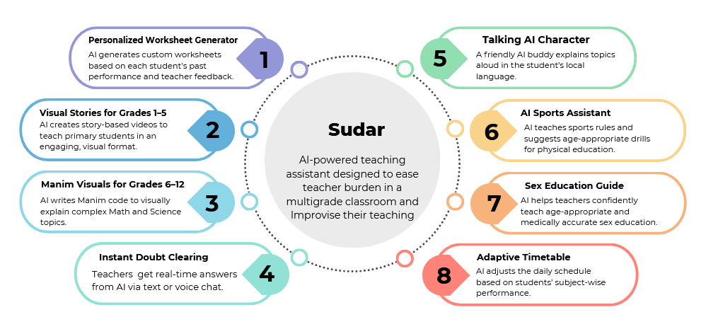
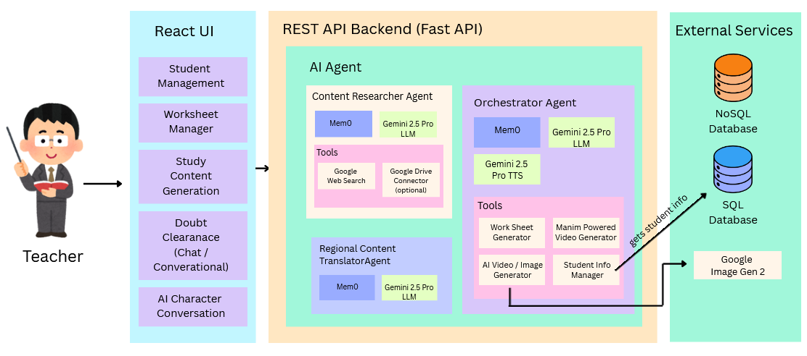

<div align="center">

<h2><b>An AI powered platform for empowering teachers in a multigrade classrooms</b></h2>
</div>

## **Features**


1) Using Gen AI to help teachers generate worksheets for various grade levels with given the topic. The worksheets will be generated by customising a particular student’s performance on previous worksheets . If the student performs well in previous worksheet the next worksheet will have much more hard problems for the student to learn wider ,by the student performance if we observe that the student’s performance is lacking basic concepts then the next worksheet will cover the basic questions for students understanding. The AI Agent understands the learning capabilities of each student by using the teacher’s remarks of each student’s performance on the tests generated by AI.

2) For small grade students like (grade 1 - 5) , the teachers can ask the AI agent to generate visual content (videos)  like stories to convey the study lessons in a creative and interactive way. Here for generating videos we are going to use an image generation model combined with a text to speech model, not a video model. 

3) For higher grade students like (grade 6 - 12) , the teachers can use this AI agent to create visual representations of complex mathematics , physics topics using the manim library. The AI codes the manim code and this code is used to generate the visuals.
The teachers can use this AI agent for instant doubt clearing sessions in both textual messages and interactive audio conversations.

4) Talking AI Character: A friendly AI character can speak answers to students’ questions in their local language — like a virtual teacher buddy who explains things by talking,

5) UsingAI,Teachers can teach different sports, explain the rules, and suggest simple drills needed to train students in a multi-grade classroom.

6) Equip teachers (especially in rural & semi-urban India) with an AI assistant that helps them teach age-appropriate, medically accurate,       culturally sensitive sex education without fear or discomfort.

## **Block Diagram**


## **Sudar AI Agent Setup**

This guide will walk you through the setup process for the Sudar AI Agent project.

## Prerequisites

Before you begin, ensure you have the following installed:

-   [Docker](https://www.docker.com/get-started) and [Docker Compose](https://docs.docker.com/compose/install/)
-   [Python](https://www.python.org/downloads/) (version 3.10 or higher)
-   [UV Package Manager](https://docs.astral.sh/uv/) (recommended) or pip

## Setup Instructions

Follow these steps to get the project up and running:

### 1. Configure Environment Variables

First, you need to set up your environment variables.

1.  In the root directory of the project, make a copy of the `.env.template` file and rename it to `.env`.

2.  Open the new `.env` file and add your Google API key to the `GOOGLE_API_KEY` variable and tavily api key to `TAVILY_API_KEY` variable:

    ```
    GOOGLE_API_KEY="YOUR_GOOGLE_API_KEY"
    TAVILY_API_KEY="YOUR TAVILY_API_KEY"
    ```

### 2. Run Necessary Services

Next, use Docker Compose to build and run the required services in the background.

```bash
docker-compose up -d
```

This command will start all the services defined in the `docker-compose.yml` file.

### 3. Set Up the Python Environment

#### **Using UV (Recommended - 10x Faster)**

1.  **Install UV** (one-time setup):

    **Windows (PowerShell):**
    ```powershell
    pip install uv
    ```

2.  **Create virtual environment and install dependencies:**

    ```bash
    # Install all dependencies
    uv sync
    ```

3.  **Run the termial app** (no activation needed):
    ```bash
    uv run python -m agent.terminalChat
    ```